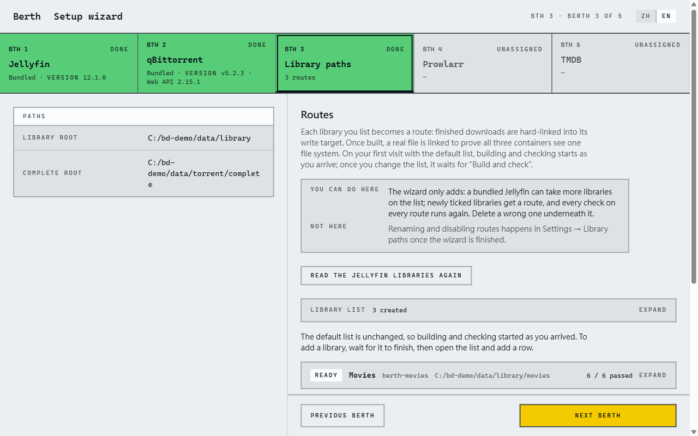
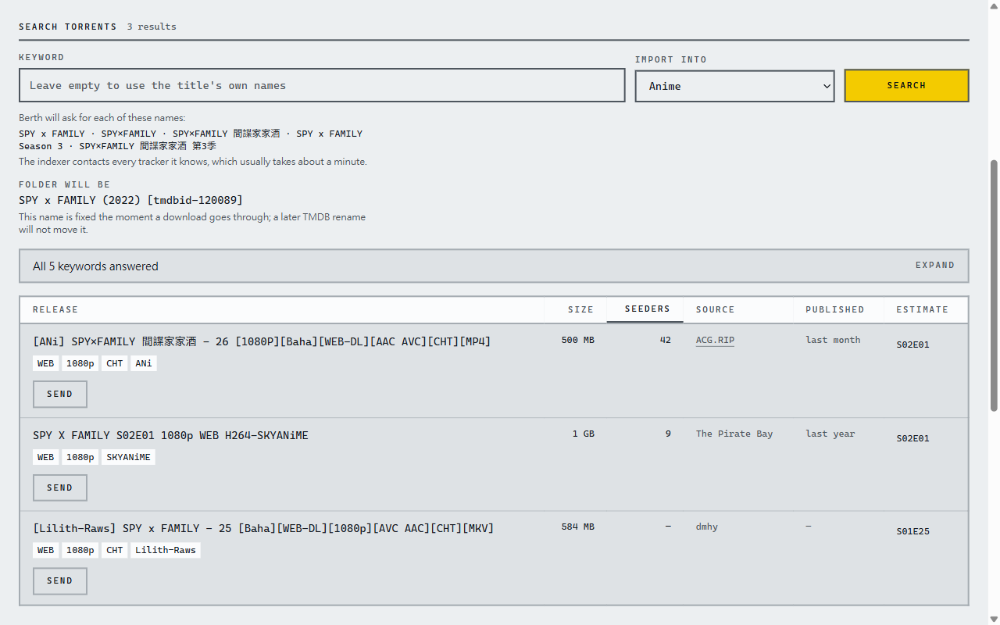
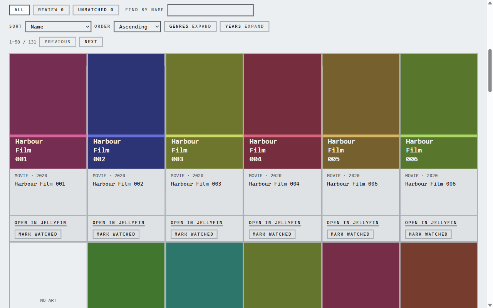
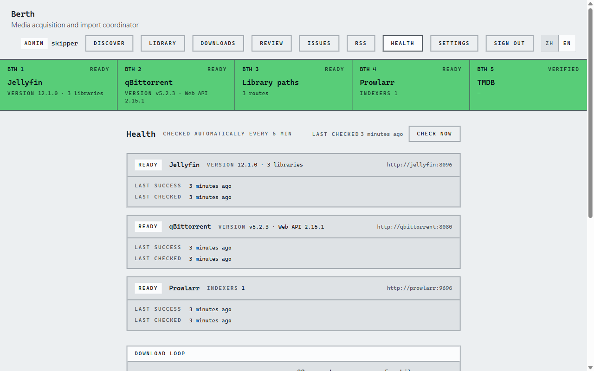

# Berth

**English** · [繁體中文](README.zh-Hant.md)

Self-hosted media acquisition that ends in your Jellyfin library.

## Why Berth

I built Berth because the usual stack, Seerr (Jellyseerr or Overseerr) in front of Sonarr and Radarr, felt
complicated to set up and use, and a request often did not end with the release I wanted. Berth works
differently: you pick the release yourself from a Prowlarr search, or follow an RSS feed, and Berth takes it into
Jellyfin. It also reads Mikan's RSS, for following the current anime season.

## What it does

- Search Prowlarr from a title's page; you pick the release.
- Follow Mikan, Nyaa and acg.rip RSS feeds; new episodes are sent and imported automatically.
- Identify each film or episode from TMDB and hardlink it into Jellyfin under a name it recognises, so nothing
  is stored twice.
- Keep a ledger of every file it placed; a nightly check reports deleted episodes, hardlinks replaced by copies and
  unclaimed torrents, and lists the options for each.
- Recheck the services and library paths every 5 minutes on a health page.
- Walk you through setup: configure the bundled Jellyfin, qBittorrent and Prowlarr or connect yours, and prove
  with a real file that hardlinks work.
- Show its interface in English or Traditional Chinese.

| | |
| --- | --- |
|  |  |
|  |  |

Berth is a public beta. Read [Status & known limitations](#status--known-limitations) before relying on it.

## What you need

- Docker Engine or Docker Desktop with Compose 2.23.1 or newer (`docker compose version`; `docker compose`, not
  `docker-compose`).
- A folder for downloads and media on one local disk that supports hardlinks: not exFAT, not a network share.
  Details in [Requirements](docs/guide/requirements.md).
- **A free TMDB API key. Get it first**; it takes about five minutes:
  1. Sign up at <https://www.themoviedb.org/signup> and confirm the email.
  2. Open <https://www.themoviedb.org/settings/api> and request an API key; choose **Personal / Education**.
     It is issued immediately.
  3. Keep either the **API Key** or the **API Read Access Token**; Berth accepts both.

## Install

1. Make a folder for Berth and put two files in it: [`docker-compose.yml`](https://raw.githubusercontent.com/1morr/Berth/v0.2.1/deploy/docker-compose.yml), and
   [`.env.example`](https://raw.githubusercontent.com/1morr/Berth/v0.2.1/deploy/.env.example) saved as `.env`. Nothing else goes next to them. Both links are this
   release's copies, so the compose file is never newer than the image. On Unraid, paste the two into Compose Manager
   instead: see [Unraid](docs/guide/requirements.md#unraid).

   ```bash
   mkdir berth && cd berth
   curl -fsSLo docker-compose.yml https://raw.githubusercontent.com/1morr/Berth/v0.2.1/deploy/docker-compose.yml
   curl -fsSLo .env https://raw.githubusercontent.com/1morr/Berth/v0.2.1/deploy/.env.example
   ```

2. Edit `.env`:
   - `DATA_ROOT`: where downloads and the libraries live, and `CONFIG_ROOT`: where the four services keep their
     settings. The defaults `./data` and `./config` are fine for a trial; for real use, give absolute paths on your
     media disk (`/srv/berth/data`, `C:\Berth\data`). On Unraid they must be absolute.
   - `PUID` / `PGID`: the account that owns `DATA_ROOT` (`id -u` / `id -g`; Unraid: `99` / `100`;
     [rootless Docker](docs/guide/requirements.md#rootless-docker): `0` / `0`). Leave them on Docker Desktop for
     Windows.
   - `TZ`: your time zone, e.g. `Europe/London`.
   - Already running Jellyfin, qBittorrent or Prowlarr? Remove it from `COMPOSE_PROFILES` to connect yours, or
     change its `*_PORT` to run both. Otherwise `up -d` stops at `port is already allocated`. See
     [Connecting services you already run](docs/guide/existing-services.md).

3. Start it, and wait until `berth` shows `(healthy)` (about a minute on the first pull):

   ```bash
   docker compose up -d
   docker compose ps
   ```

4. Open <http://localhost:8383> and follow the wizard.

## The setup wizard

Six pages. On the Jellyfin, qBittorrent and Prowlarr pages you first choose **Bundled** (started by this compose
file) or **Existing** (one you already run); Berth tests each choice on the spot.

1. **Jellyfin**: create the Jellyfin admin, or sign in as one. This account is also how you sign in to Berth.
2. **qBittorrent**: set its web UI login, or enter your existing one's address and login.
3. **Library paths**: each library gets a *Route* (the path from download to library), and Berth proves with
   a real file that hardlinks work. Bundled Jellyfin starts with Movies, TV and Anime; with your own, you tick
   which libraries Berth may write to.
4. **Prowlarr**: add the recommended public indexers with one press, or use your own. You can skip this.
5. **TMDB**: paste your key. It must pass the test.
6. **Finish**: what you skipped and where to finish it.

Page by page, with what Berth changes in each service: [Setup wizard](docs/guide/setup-wizard.md).
Back up `${CONFIG_ROOT}/berth` (`./config/berth` by default); that folder is everything Berth knows.

## Status & known limitations

Berth is a **public beta**.

- It works with **Jellyfin 12.0 or newer** and **Prowlarr** only. No Emby, Plex or Jackett.
- No notifications yet: open Berth to see what needs you.
- Tested end to end on **Windows with Docker Desktop** and on **Unraid 7.1**. On **Ubuntu 26.04 with rootless
  Docker**, the whole setup wizard and sending a release have been run, but not an import
  ([trial notes](docs/research/linux-trial-2026-10-09.md), in Chinese). Other Linux distributions and NAS systems
  have not been tested yet.
- **Don't expose Berth directly to the internet.** Reach it over your LAN or a VPN.
- Known issues (tracking notes, in Chinese):
  - Without Prowlarr (skipped in the wizard or removed later) the health page stays red; there is no "don't use
    Prowlarr" option yet ([61](.scratch/m4/issues/61-prowlarr-optional.md)).
  - When a new import does not show up, Berth asks Jellyfin to scan every library, not only its own, and the first
    import into an empty library can take over ten minutes to show as found
    ([62](.scratch/m4/issues/62-jellyfin-scan-scope.md)).
  - When an existing service lacks the `/data` mount, the fix shown says `${DATA_ROOT}:/data` instead of your
    actual folder, and Jellyfin's mount is only checked on page 3
    ([63](.scratch/m4/issues/63-copyable-mount-remedies.md)).
  - An existing Jellyfin needs a library of each type you want; Berth adds a path to it but does not create one
    ([64](.scratch/m4/issues/64-new-library-on-existing-jellyfin.md)).
  - After switching to another qBittorrent, torrents still seeding on the old one stay there untracked, and Berth
    does not say so ([65](.scratch/m4/issues/65-switch-explains-what-stays.md)).
- Fixed since the last audit:
  - Switching qBittorrent rechecks every Route by itself, and the health page no longer shows unchecked Routes as
    green ([59](.scratch/m4/issues/59-health-tells-the-truth-after-switch.md)).
  - After a reinstall or a lost database, the wizard's last page and **Issues** offer to rebuild the ledger from
    the library ([60](.scratch/m4/issues/60-rebuild-ledger-from-the-ui.md)).

## Guides

- [Setup wizard](docs/guide/setup-wizard.md): each page in detail, accounts and passwords, the pages after setup.
- [Connecting services you already run](docs/guide/existing-services.md): the `/data` mount (Compose,
  `docker run`, Unraid templates), `COMPOSE_PROFILES`, switching servers.
- [Requirements](docs/guide/requirements.md): hardlinks, Linux / Windows / Unraid, minimum service versions.
- [Upgrading](docs/guide/upgrading.md): image tags, upgrade steps, building your own image.
- [Troubleshooting](docs/guide/troubleshooting.md): ports, `Unauthorized`, `host.docker.internal`.
- [Backup, secrets and reinstalling](docs/guide/backup-and-reinstall.md): what Berth stores, starting over,
  rebuilding the ledger.
- [CHANGELOG](CHANGELOG.md): what changed in each version.
- [Development](docs/development.md) (in Chinese): building, testing and the project layout.

## License and attribution

MIT, see [LICENSE](LICENSE).


This product uses the TMDB API but is not endorsed or certified by TMDB. TMDB's terms allow non-commercial use
only.
