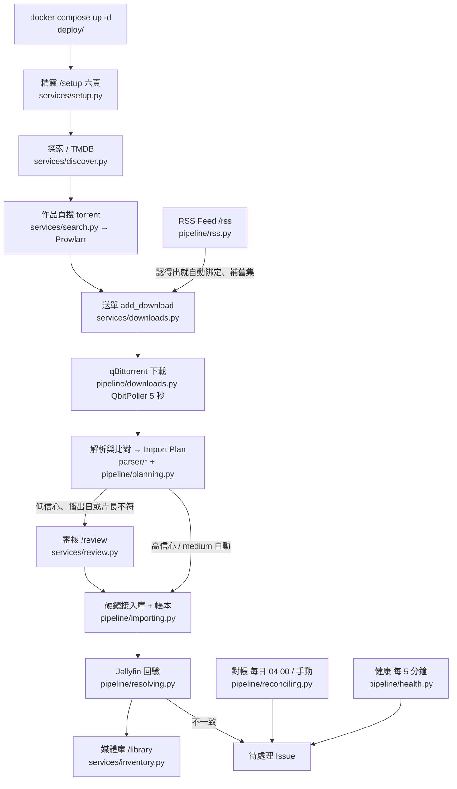

# Berth 設定精靈與整體可用性審計（2026-10-06）

範圍：main `5f3717f`。只審計、不改程式；改進拆票交給後續 session。
截圖在 [`wizard-audit-2026-10-06/`](wizard-audit-2026-10-06/)（檔名前綴 `s1`–`s6` 對應下面的情境）。

## 結論先講

- **核心主流程是通的**：全新安裝、三個服務都選套件內，精靈六頁走完；之後在探索頁找一部公有領域電影、搜尋、送單，下載完成後**不經人工**解析、硬鏈接入庫，Jellyfin 在入庫後約 2 分鐘認到（送單到 Jellyfin 看得到約 8 分鐘）。
- **精靈的錯誤訊息大多寫得好**：localhost、版本太舊、非管理員、帳密錯、API key 錯、掛載不對，每一種都說得出「哪一條、為什麼、怎麼修」，掛載錯還附 compose 片段（§C3）。
- **接管模型其實已經接近你預期的版本**：既有服務除了檢查，Berth 還會寫它「自己擁有的東西」（Jellyfin API key、Berth 路徑、`berth-*` 分類、你確認加入的站）。`CONTEXT.md` 說的「只做檢查」是**文件過時**，不是實作（§B）。
- **套件內並不是「基本不用操作」**：密碼要打 4 次、每頁都有一顆要按的套用鍵、Prowlarr 頁要測站→勾→加→再設登入（§B1）。
- **找到一個會擋送單的實際問題**：套件內 qBittorrent 的全域 `save_path` 被改（Berth 自己根本不用這個鍵），三條 Route 全部轉紅、送單被拒，而且錯誤訊息指錯對象（§S5、P0-1）。
- **還不能交給一般自架使用者**：沒有可拉的 image（`ghcr.io/1morr/berth:latest` 是空的）、原生 Linux / NAS 沒有人跑過、沒有任何主動通知；適合願意自己 build image 的進階使用者試用（§3.3）。

## 需要你拍板的決定

**2026-10-06 已拍板：D1–D8 全部照下表的建議**（記在 brief §19「精靈審計後的八項」）。下表保留當時的選項與理由。

| # | 問題 | 選項 | 建議 |
| --- | --- | --- | --- |
| **D1** | 「接管」的定義：既有服務要不要讓 Berth 改它的全域設定？ | (a) 維持現狀：只寫 Berth 擁有的物件，全域偏好與帳密不碰；(b) 你描述的完整接管：檢查通過後 Berth 也改全域偏好（save path、autoTMM、登入…） | **(a)，並把它當成套件內與既有共同的模型**（見 D2）。理由與風險見 §B2 |
| **D2** | 套件內 qBittorrent 要不要也停止寫三個全域鍵（`save_path`、`auto_tmm_enabled`、`category_changed_tmm_enabled`）？ | (a) 停止，套件內與既有在 qBittorrent 上行為一致，只剩「介面登入」不同；(b) 維持 | **(a)**。Berth 送單逐個 torrent 帶分類與 `autoTMM=true`，這三鍵本來就不影響 Berth（brief §16.4 自己這樣說）；拿掉後頁 2 的差異表、設定頁的漂移表與「還原建議設定」都可以刪，P0-1 的紅燈也不存在了 |
| **D3** | BTH 4 只支援 Prowlarr，拿掉通用 Torznab 端點？ | (a) 拿掉；(b) 保留但從精靈隱藏（只在設定頁）；(c) 維持 | 傾向 **(a)**，但這推翻 brief §3「只依賴 Torznab 協定、支援 Jackett」的決定，屬產品範圍縮減。利弊見 §D |
| **D4** | 套件內 qBittorrent / Prowlarr 的介面登入怎麼收 | (a) 維持各頁各設一次（密碼再打兩次）；(b) 頁 1 建擁有者時多一個勾選「套件內 qBittorrent 與 Prowlarr 也用這組」，精靈期間前端暫存密碼（不落地），到那兩頁自動套用；重新整理後才再問；(c) 不設，留給使用者自己（Prowlarr 第一次開會強迫設，qBittorrent 只剩 log 的臨時密碼） | **(b)**：與 Jellyfin 自己的啟動精靈「一組帳號」的直覺一致，密碼從 4 次降到 2 次（建立時的兩次） |
| **D5** | 沒有實際寫入的確認鍵要不要拿掉：既有 qBittorrent 的「確認，不改任何設定」、套件內重跑時的「套用這 0 項」 | (a) 拿掉，測試通過就算這一頁完成；(b) 保留 | **(a)**。Sonarr / Seerr 都是「測試通過 + 儲存」一步；這兩顆鍵按下去什麼都不做 |
| **D6** | 換一台服務時，Berth 在舊那一台留下的東西要不要清 | (a) 換台時列出留下了什麼（分類、Berth 路徑、站、登入），提供「移除 Berth 建的分類 / 路徑」按鈕，只刪 Berth 擁有而且是空的；(b) 維持只用文案說「不撤回」 | **(a) 的「列出」部分一定做**，刪除按鈕視 D1 而定 |
| **D7** | 頁 3 套件內要不要恢復「進頁自動建立並檢查」 | (a) 預設清單不變時自動跑，要改清單再展開；(b) 維持按鈕 | (a)。M3 票 06d 曾經是自動跑，M4 票 08 改回按鈕的理由是「進頁不送寫入」——對套件內來說這個理由弱 |
| **D8** | 先發一版 image 還是先修 | (a) 現在就打 `v0.1.0` tag 讓 `:latest` 有東西；(b) P0 修完再發 | (b)。P0-1 會讓一般使用者第一次動 qBittorrent 設定就卡住 |

## 環境與方法

- 部署：`C:\Users\Roxy\berth-audit`，照 repo 的 `deploy/docker-compose.yml` 與 `.env.example` 原樣（預設 port 8383 / 8096 / 8080 / 9696），只用 override 把 image 換成本機的 `berth:audit-5f3717f`。
  - **環境限制 1：GHCR 的 `:latest` 是空的**，所以沒有照 README 直接 `docker compose up -d` 拉 image。用的是本機已建好的 image，我確認過它含 `19ac345` 的程式碼（`complete_setup` 的 `_UNFINISHED` 字串在 image 裡）。
  - 為了用預設 port 與容器名，把先前 QA 用的 `C:\Users\Roxy\berth-trial` 做了 `docker compose down`（資料在 bind mount，沒有刪；還原見文末）。
- 既有服務：
  - 新建 `C:\Users\Roxy\berth-audit-existing`：`mine-jellyfin`（12.1，已跑過自己的初始精靈，有媒體庫 `Shows` 在 `/data/media/shows`、一個非管理員帳號）、`mine-qbittorrent`（5.2.3，已設自己的帳密，預設下載路徑 `/data/downloads`），都把 `berth-audit/data` 掛在 `/data`。
  - 錯誤組沿用既有的 `C:\Users\Roxy\berth-existing\broken`（10.10.7 的 Jellyfin、4.3.9 的 qBittorrent、掛 `/downloads` 的 qBittorrent、1.0.1 的 Prowlarr）。
  - 測試帳密在 `C:\Users\Roxy\berth-audit\CREDENTIALS.md`（repo 外）。
- 操作：playwright 實際點網頁；需要看服務內部狀態時用各服務的 API 讀。
- **環境限制 2：TMDB key 沒有在畫面上貼**。為了不把 repo `.env` 裡的真 key 寫進對話，我用瀏覽器的 session 對同一支 `POST /api/setup/tmdb/test` 送出，再重新載入頁面確認畫面狀態。錯的 key 與格式錯的 key 都是在畫面上測的。
- **環境限制 3：真 torrent 只下載了一部公有領域電影**（《活死人之夜》1968，YTS 720p，790 MB）。RSS 只用「一次性 RSS 連結」讀到清單、沒有送單，避免下載有版權的動畫。
- **環境限制 4：只在 Windows Docker Desktop 上跑**。原生 Linux（`host-gateway`、PUID / PGID 權限）沒有驗。
- 沒有測到的：既有 Jellyfin 掛錯目錄（要先在那一台成立擁有者，換台會被擁有者鎖擋）、Torznab 端點、多使用者權限（M2 驗收過，本次沒重驗）。

## 第一階段：情境結果

### S1 全新安裝、三個服務都選套件內

| 頁 | 使用者要做的事 | 結果 | 截圖 |
| --- | --- | --- | --- |
| 1 Jellyfin | 點「套件內」→ 填帳號、密碼兩次 → 「建立管理員並登入」 | 建立管理員、跑完 Jellyfin 初始設定、建 API key「Berth」。帳號規則與兩次密碼不同是逐欄位提示 | [s1-02](wizard-audit-2026-10-06/s1-02-page1-bundled.jpg)、[s3-01](wizard-audit-2026-10-06/s3-01-page1-bad-username-mismatch.jpg)、[s1-03](wizard-audit-2026-10-06/s1-03-page1-owner-done.jpg) |
| 2 qBittorrent | 點「套件內」→ 再打一次 Jellyfin 密碼（沿用帳密）→ 「套用這 4 項」 | 寫三個全域鍵 + WebUI 登入。打錯密碼：「這不是 audit 的 Jellyfin 密碼，所以什麼都沒寫；改好再按一次。」 | [s1-04](wizard-audit-2026-10-06/s1-04-page2-bundled-ok.jpg)、[s1-05](wizard-audit-2026-10-06/s1-05-page2-applied.jpg) |
| 3 媒體庫路徑 | 「建立並檢查」 | 建 Movies / TV / Anime 三個媒體庫與三條 Route，6/6 全綠。**約 30 秒，期間只有一顆「建立並檢查中…」，看不到進度** | [s1-07](wizard-audit-2026-10-06/s1-07-page3-built.jpg)、[s1-08](wizard-audit-2026-10-06/s1-08-page3-done.jpg) |
| 4 索引站 | 點「套件內」→「測試全部」→ 勾通過的站 →「加入 N 個站」→ 再打一次密碼 →「設定介面登入」 | 9 個推薦站：Nyaa 連不上、1337x / EZTV 被 Cloudflare 擋，6 個通過。另從「其他公開站」測了 Internet Archive：**測試通過、加入時卻失敗**（「連不上」）。最後加入 6 站 | [s1-10](wizard-audit-2026-10-06/s1-10-page4-bundled.jpg)、[s1-11](wizard-audit-2026-10-06/s1-11-page4-done.jpg) |
| 5 TMDB | 貼 key →「測試 TMDB」 | 格式不對前端先擋；32 位十六進位但錯的 key 有清楚補法。**錯的 key 也被存下**（右欄「已存下，沒通過驗證」） | [s1-12](wizard-audit-2026-10-06/s1-12-page5-verified.jpg) |
| 6 完成 | 「完成設定」 | 列出三個服務的網址與該用哪個帳號登入 → 進探索頁 | [s1-13](wizard-audit-2026-10-06/s1-13-page6-complete.jpg)、[s1-14](wizard-audit-2026-10-06/s1-14-after-complete.jpg) |

全程密碼打了 4 次（建立 2 次、qBittorrent 1 次、Prowlarr 1 次），必按的鍵 11 顆以上。

### S2 混用既有服務（既有 Jellyfin + 既有 qBittorrent + 套件內 Prowlarr）

照 README：把 `COMPOSE_PROFILES` 改成 `prowlarr` 再 `docker compose up -d`。

- **README 的指示不會停掉套件內那兩台**：`up -d` 之後 `berth-jellyfin`、`berth-qbittorrent` 照樣在跑，要另外 `docker compose stop jellyfin qbittorrent`（Compose 對不在啟用 profile 裡的服務不動既有容器）。精靈頁上的「套件內」卡片在它們還在跑時也不會提醒。
- 頁 1：選既有、填位址、「測試連線」→ 用 `nasadmin` 登入成為擁有者。Berth 在那一台只多了 API key「Berth」，語言、地區、遠端存取都沒動（[s2-02](wizard-audit-2026-10-06/s2-02-p1-existing-connected.jpg)、[s3-07](wizard-audit-2026-10-06/s3-07-p1-owner-ok.jpg)）。
- 頁 2：填位址與帳密 → 測試通過 → **還要再按「確認，不改任何設定」**才能前進（[s3-11](wizard-audit-2026-10-06/s3-11-p2-qbit-wrongmount-connected.jpg)）。
- 頁 3：勾 `Shows`、寫入目標預設「新的 Berth 路徑 `/data/library/shows`」，畫面列出按下之後會做的三件事 → 「建立並檢查」→ 6/6（[s2-05](wizard-audit-2026-10-06/s2-05-p3-existing-choose.jpg)、[s2-06](wizard-audit-2026-10-06/s2-06-p3-existing-ok.jpg)）。
  - 既有 Jellyfin 只有一個劇集媒體庫，電影沒有地方放；Berth 對既有 Jellyfin 不建媒體庫，要使用者自己去 Jellyfin 建。畫面沒有提示「沒有電影媒體庫」。
- 頁 4、5、6 正常（[s2-08](wizard-audit-2026-10-06/s2-08-p6-complete.jpg)）。完成頁把 `host.docker.internal:47096` 轉成瀏覽器可開的 `localhost:47096`，很貼心。

實測 Berth 對既有服務寫了什麼（API 讀出）：

| 服務 | 前 | 後 |
| --- | --- | --- |
| mine-jellyfin | 媒體庫 Shows `[/data/media/shows]`；無 API key | Shows `[/data/library/shows, /data/media/shows]`；API key `Berth`。設定、使用者不變 |
| mine-qbittorrent | `save_path=/data/downloads`、autoTMM false、無分類 | 全域偏好**完全不變**；多一個分類 `berth-shows`（save `/data/torrent/complete/shows`、download `/data/torrent/incomplete/shows`）；探測 torrent 已清掉 |
| bad-qbittorrent（掛錯、後來換掉的那台） | — | 留下 `berth-shows` 分類（加上更早 QA 留下的 `berth-movies`）——換台不清 |

### S3 故意做錯

| 錯誤 | 畫面說了什麼（原文節錄） | 看完知不知道怎麼修 | 截圖 |
| --- | --- | --- | --- |
| 套件內 qBittorrent 容器停掉 | 卡片：「這套 compose 沒有起 qBittorrent。」測試：「找不到這個名字的主機」＋手動步驟（加回 `COMPOSE_PROFILES` 或改選既有）與兩行可複製指令 | 知道，但**卡片那句是錯的**：它在 compose 裡，只是停了。**重啟、重新測試轉綠之後，卡片仍寫「沒有起」** | [s3-02](wizard-audit-2026-10-06/s3-02-page2-bundled-qbit-stopped.jpg)、[s1-04](wizard-audit-2026-10-06/s1-04-page2-bundled-ok.jpg) |
| Jellyfin 位址填 `localhost` | 欄位下立即提示：「Berth 在容器裡，這個位址指的是 Berth 自己…改填 host.docker.internal…」；測試結果「找得到這台主機，但它沒有回應」＋同一句補法 | 知道 | [s3-03](wizard-audit-2026-10-06/s3-03-p1-jellyfin-localhost.jpg) |
| qBittorrent 位址填 `localhost` | 同上 | 知道 | [s3-08](wizard-audit-2026-10-06/s3-08-p2-qbit-localhost.jpg) |
| Jellyfin 10.10.7 | 「連得上，但版本比 Berth 支援的下限舊」「至少要 Jellyfin 12.0，這一台是 10.10.7；等也不會好。升級之後再測一次。」 | 知道（卡片上有升級注意的連結） | [s3-04](wizard-audit-2026-10-06/s3-04-p1-jellyfin-10.10.jpg) |
| qBittorrent 4.3.9 | 「至少要 qBittorrent 4.4，這一台是 v4.3.9；等也不會好。」 | 知道 | [s3-09](wizard-audit-2026-10-06/s3-09-p2-qbit-4.3.9.jpg) |
| Prowlarr 1.0.1 | 「至少要 Prowlarr 1.3.2，這一台是 1.0.1.2220；等也不會好。」 | 知道 | [s3-13](wizard-audit-2026-10-06/s3-13-p4-prowlarr-1.0.1.jpg) |
| Jellyfin 非管理員帳號 | 「這個帳號登得進 Jellyfin，但不是管理員。擁有者要改得動設定——用這台 Jellyfin 的管理員登入。」 | 知道 | [s3-05](wizard-audit-2026-10-06/s3-05-p1-nonadmin.jpg) |
| Jellyfin 密碼錯 | 「Jellyfin 不認這組帳號或密碼。」 | 知道 | [s3-06](wizard-audit-2026-10-06/s3-06-p1-wrongpass.jpg) |
| qBittorrent 密碼錯 | 「帳密不被接受」「帳號或密碼不對。改好上面的欄位再測一次。」 | 知道 | [s3-10](wizard-audit-2026-10-06/s3-10-p2-qbit-wrongpass.jpg) |
| Prowlarr API key 錯 | 「API key 不對：在 Prowlarr 的「設定 → 一般」複製 API key（不是介面登入的密碼）」 | 知道。**但右欄仍寫「API key 已取得」** | [s3-14](wizard-audit-2026-10-06/s3-14-p4-prowlarr-wrongkey.jpg) |
| qBittorrent 沒掛 `/data`（掛 `/downloads`） | 頁 2 測試**通過**；頁 3 第三條纜繩失敗：「qBittorrent 看不到 Berth 放在 /data/torrent/complete/shows 的檔案：兩邊的這個路徑不是同一個目錄。」＋手動步驟與 compose 片段 `- ${DATA_ROOT}:/data` | 知道。但補法要求「下載目錄也移到它底下…不要分開掛 /downloads」，**超出 Berth 需要的**（見 §C2） | [s3-12](wizard-audit-2026-10-06/s3-12-p3-qbit-wrongmount.jpg) |
| TMDB key 錯 | 「TMDB 不收這把 key：多半是貼錯、少貼了幾個字…到 TMDB 的 API 設定頁重新複製」 | 知道 | — |

### S4 精靈完成後打開三個套件內服務

- **Jellyfin**（`localhost:8096`）：乾淨的瀏覽器直接是登入頁，用擁有者 `audit` 登入，**沒有它自己的 onboarding**，首頁是三個媒體庫（[s4-03](wizard-audit-2026-10-06/s4-03-jellyfin-logged-in.jpg)）。
  - 伺服器名稱是空的，顯示成容器 ID `d6c8b33ddada`；精靈沒設 ServerName。
  - 介面語言、metadata 語言與國家跟著 Berth 的 UI 語言（zh-TW / TW），套件內不問。
  - playwright 預設 profile 先前開過別台 8096，出現 Jellyfin 的「伺服器不相符」——那是瀏覽器殘留，不算 Berth 的問題（[s4-02](wizard-audit-2026-10-06/s4-02-jellyfin-fresh-browser.jpg) 是乾淨的那次）。
- **qBittorrent**（`localhost:8080`）：登入頁，`audit` + 擁有者密碼進得去，沒有額外設定步驟（[s4-04](wizard-audit-2026-10-06/s4-04-qbittorrent-logged-in.jpg)）。
- **Prowlarr**（`localhost:9696`）：登入頁，`audit` 進得去，6 個站都在，沒有「強迫設登入」的視窗（[s4-05](wizard-audit-2026-10-06/s4-05-prowlarr-logged-in.jpg)）。

結論：三個服務都不需要再跑自己的 onboarding；帳密全是擁有者那一組（完成頁也是這樣說）。

### S5 重新執行精靈：冪等性與使用者事後的修改

1. 精靈完成後打開 `/setup` 會被導向 `/settings/jellyfin`（[s5-01](wizard-audit-2026-10-06/s5-01-setup-after-complete.jpg)）：**精靈跑完不能重跑**，之後的修改都在設定頁。
2. 我在 qBittorrent 手動把全域 `save_path` 改成 `/data/my-downloads`、`auto_tmm_enabled` 改成 false，並建了自己的分類 `mine`：
   - 設定頁列出「2 個鍵與建議值不同」（[s5-02](wizard-audit-2026-10-06/s5-02-settings-qbit-drift.jpg)）；健康重測**不會**自動改回（API 讀出仍是我改的值）。✔
   - **但三條 Route 全部從 6/6 變 1/6「阻擋」，送單被拒**：「那條 Route 現在是紅的，送出去也一定進不了庫」。健康頁那一條寫的是「qBittorrent 的路徑 Berth 看得到 `/data/torrent/complete/movies`」，下面的錯誤卻是「Berth 的容器裡沒有 /data/my-downloads 這個目錄…是這個目錄被刪了或改了名」（[s6-05](wizard-audit-2026-10-06/s6-05-health-route-red.jpg)）。
     - 原因：`berth/services/routes.py:1022-1028` 對套件內那一台另外現查全域 `save_path`，看不到就整條紅；Berth 送單其實走分類路徑（同一段 docstring `:1014-1016` 自己說既有那台不看全域，理由是 Berth 不落在那裡——對套件內同樣成立）。
     - 使用者只是想讓自己手動加的 torrent 換個地方放，結果 Berth 不能送單，畫面還叫他「把目錄建回來」。
   - 「還原建議設定」**一按就寫回，沒有確認**，我建的 `mine` 分類保留。還原後健康頁重測回到「已繫上」，但只有 5/6（qBittorrent 探針不在 5 分鐘健康迴圈裡跑，progress.md 偏差區記為待確認），可以送單。
3. 重裝保留各服務 config（刪掉 Berth 自己的 DB 再跑一次精靈）：
   - 套件內 Jellyfin：表單自動變成「用你的 Jellyfin 管理員登入」，右欄寫「不改這台 Jellyfin 的任何設定」（[s5-05](wizard-audit-2026-10-06/s5-05-rerun-p1.jpg)）。
   - 套件內 qBittorrent：三鍵都標「已經是這樣」、WebUI 登入已設不再強迫，但**必須按「套用這 0 項」**才算完成（[s5-06](wizard-audit-2026-10-06/s5-06-rerun-p2.jpg)）。
   - 頁 3：「媒體庫清單 3 個已建立」，按「建立並檢查」→ 6/6，沒有卡住（M4 票 24 修過的情況）（[s5-08](wizard-audit-2026-10-06/s5-08-rerun-p3-done.jpg)）。
   - 套件內 Prowlarr：6 站都認得、介面登入「已經是這樣」（[s5-04](wizard-audit-2026-10-06/s5-04-p4-bundled-rerun.jpg)）。這時擁有者已經換成 `nasadmin`，Prowlarr 登入仍是上一個 Berth 設的 `audit`，完成頁卻寫「帳號 audit，密碼是精靈裡設的那一組」——這一輪精靈並沒有設。
   - API 讀出：Jellyfin 仍只有一把 `Berth` key、三個媒體庫沒有重複；qBittorrent 分類沒有重複。**冪等成立。**
   - 重裝後的新 DB 不知道上一輪入庫的那部電影（帳本是空的）；README 有 `berth rebuild-ledger`，精靈沒提。

### S6 主流程冒煙測試

| 段 | 結果 | 截圖 |
| --- | --- | --- |
| 探索 | TMDB 趨勢正常 | [s1-14](wizard-audit-2026-10-06/s1-14-after-complete.jpg) |
| 作品頁搜尋 | 5 個名字各問一次，111 筆、109 筆名字對不上已略過；約 1 分鐘。顯示的結果裡有 1990 / 2006 的重拍版與《Below Deck Down Under S04E02 Night of the Living Dead》（年份與「這是電影」都沒用來篩） | [s6-02](wizard-audit-2026-10-06/s6-02-search-results.jpg) |
| 送單 | 選 Movies、確認、印出資料夾名。第一次被 P0-1 擋，修好後送出 | [s6-05](wizard-audit-2026-10-06/s6-05-health-route-red.jpg) |
| 下載 | `berth-movies` 分類、`/jobs` 即時進度，約 6 分鐘下完（2.5 MB/s） | [s6-06](wizard-audit-2026-10-06/s6-06-jobs-downloading.jpg) |
| 解析與入庫 | 下完數十秒內 `imported`，`Night of the Living Dead (1968) [tmdbid-10331] - [BD][720p][YTS.AM].mp4`，帳本「對得上」 | [s6-11](wizard-audit-2026-10-06/s6-11-media-imported.jpg) |
| Jellyfin | 入庫後約 2 分鐘 Jellyfin 有這部（TMDB 10331），媒體庫頁出現在牆上，作品頁有「在 Jellyfin 看」。**同一時間作品頁的「檔案與版本」仍寫「Jellyfin 還在掃描，下一次查詢 9 分鐘後」**（resolver 退避） | [s6-13](wizard-audit-2026-10-06/s6-13-media-in-jellyfin.jpg)、[s6-14](wizard-audit-2026-10-06/s6-14-library-movies-in.jpg) |
| RSS | 用「一次性 RSS 連結」讀 `acg.rip/.xml?term=Frieren`：30 筆、勾選介面正常。**「S01 + S02」與「S1-S2」兩包被標成 `S01E02`**；「送到哪一部作品」自動搜 TMDB 是「沒有找到」。沒有送單 | [s6-08](wizard-audit-2026-10-06/s6-08-rss-oneshot.jpg) |
| 審核 / 待處理 / 媒體庫 | 空狀態文案清楚（「沒有事在等你」「這個程序起來之後還沒有對過帳」） | [s6-09](wizard-audit-2026-10-06/s6-09-review.jpg) |
| i18n | 切 EN 看設定頁，沒有漏翻的中文 | [s6-10](wizard-audit-2026-10-06/s6-10-en-settings.jpg) |

沒有跑完的：RSS Feed 自動綁定與自動送單、審核佇列的實際處理、對帳修復——都需要下載有版權的動畫或人為破壞媒體庫。這些在 M2、M3 驗收與 nightly e2e（`tests/e2e/test_3_m2_repair.py`、`test_4_m3_rss.py`，用 compose 裡的替身站）守著，本次沒有重跑。

## 第二階段

### A. 精靈現況

#### A1. 每一頁對服務做的修改

程式位置縮寫：`S/` = `berth/services/`、`A/` = `berth/adapters/`。

| 泊位 | 套件內 | 既有 | 需要按鍵？ |
| --- | --- | --- | --- |
| BTH 1 Jellyfin | 那一台沒初始化：`POST /Startup/Configuration`（語言、國家跟 Berth UI）、`/Startup/User` 建管理員、`/Startup/RemoteAccess`（關）、`/Startup/Complete`（`S/jellyfin.py:846-914`）。已初始化：只登入。兩種都建 API key「Berth」，先列再建不重複（`S/jellyfin.py:916-931`） | 同左；沒初始化時語言與遠端存取在畫面上問（M4 票 18）。已初始化：只登入 + API key | 「建立管理員並登入」/「登入」 |
| BTH 2 qBittorrent | 預置腳本在容器啟動前補免密白名單（只放 Berth 的 IP，`deploy/preseed/qbittorrent/10-berth.sh`）；`setPreferences` 寫 `save_path`、`auto_tmm_enabled`、`category_changed_tmm_enabled` 中與現值不同的；設 WebUI 登入（`S/qbittorrent.py:72-76,408-409`） | 一個鍵都不寫（`S/qbittorrent.py:386-387`） | 「套用這 N 項」/「確認，不改任何設定」 |
| BTH 3 媒體庫路徑 | Jellyfin：建使用者列的媒體庫（`POST /Library/VirtualFolders`，`S/jellyfin.py:874-902`）。qBittorrent：建 `berth-<slug>` 分類（帶 savePath 與 downloadPath，同名不同路徑回報衝突不覆寫，`S/routes.py:978-1007`）；探測 torrent 加入→校驗→刪除；探測檔寫入→硬鏈接→刪除 | Jellyfin：只對勾選的媒體庫 `POST /Library/VirtualFolders/Paths` 加 Berth 路徑，舊路徑不動（`S/jellyfin.py:487-608`）。qBittorrent：同左（分類、探測） | 「建立並檢查」 |
| BTH 4 Prowlarr | API key 讀唯讀掛載的 `config.xml`；`POST /api/v1/indexer` 加勾選的站；`PUT /api/v1/config/host` 設介面登入（Prowlarr 會重啟）；可移除公開站（`S/indexer.py:279-338,659-726,463-500`） | 只讀 `system/status`、indexer 清單；可測試並加推薦站（同一支 apply）；不碰登入、不移除站（`S/indexer.py:341-395`） | 「測試」「加入 N 個站」「設定介面登入」 |
| BTH 5 TMDB | 只 `GET /3/configuration`（`S/tmdb.py:97-105`） | 同左 | 「測試 TMDB」 |
| 6 完成 | 只寫 Berth 自己的 `setup.completed`；照頁序再驗每一頁（`S/setup.py:181-199`） | 同左 | 「完成設定」 |

Berth 自己存下的：Jellyfin 的 `api_key`、既有 qBittorrent 的帳密、Prowlarr 的 API key、TMDB key 都是**明文**存在 `settings` 表（`berth/models/setting.py:47-101`，README「秘密與備份」有交代：與 Seerr 相同）；擁有者的密碼不存；套件內介面登入只存 scrypt 雜湊（`S/steps.py:62-84`）。

#### A2. 最近對精靈的修改與評估

M3 的 06 系列與 M4 的 05–31 全部 `Status: done`，驗收全打勾。最近一輪（2026-09-29 之後）的重點：

| 票 | 改了什麼 | 理由 | 評估 |
| --- | --- | --- | --- |
| 15 每服務手動選擇（`8c9c284`） | 拿掉偵測；三個服務頁各自二選一；介面密碼只存雜湊 | 偵測只能靠「免密可進」「沒有站」猜，猜錯就寫使用者的服務（票 05 的事故）；Seerr / Sonarr 都是手動填 | **合理**，本次實測選擇清楚 |
| 16 容器名 `berth-*`、host-gateway（`00c66b2`） | 避免撞名讓整套起不來 | 實測撞名停在 `created` | 合理；Linux 的 host-gateway 沒實測（票 16 Comments） |
| 17 既有服務防呆（`6d5b254`） | localhost 提示、版本下限 | — | 本次實測三種下限與 localhost 都對 |
| 08 頁 3 一顆鍵（`6c6061e`） | 進頁不寫、一顆「建立並檢查」 | 進頁不該偷偷寫 | 對既有合理；**對套件內多了一個不必要的停頓**（D7） |
| 09 / 20 索引站先測再加；既有 Prowlarr 也能加站（`6a90fc8`、`bac3449`） | 預設不勾、先測再勾；0 站不算完成 | 09 試跑：一次加 9 站一堆失敗；20：0 站的 Berth 搜不到東西 | 合理，但套件內流程變成四步（測→勾→加→登入） |
| 18 擁有者鎖同一台（`c3141cb`） | ServerId | 換台等於換擁有者 | 合理 |
| 19 掛載檢查涵蓋每一台（`eeff224`） | qBittorrent 探針 torrent | 原本看不出 qBittorrent 那側沒掛 `/data` | **正確且有效**：本次實測掛 `/downloads` 的那台在頁 3 被擋下 |
| 21 / 25 錯誤分層、補法照原因（`1bd4170`、`a51b23e`） | 人話在上、原文收進技術細節；補法照原因 | 對照 *arr 與 HA | 合理，本次的錯誤文案品質就是它的成果 |
| 22 未完成目錄進分類（`616b5d3`） | 分類帶 `downloadPath`，套件內不再寫 `temp_path` | 不必動全域 | 合理。**同一個理由也適用於另外三個全域鍵**，但只拿掉了一個（D2） |
| 23 設定不互相蓋掉（`ee84da0`） | 鎖內重讀、只合併自己那段 | 實測 lost update | 正確 |
| 24 頁 3 前進條件（`0925d20`） | 重裝後頁 3 過得去 | 實測 | 本次重裝實測正常 |
| 26 qBittorrent 登入規則（`156ba7e`） | 密碼 < 6 字元先擋、失敗不留半套 | 實測 | 合理 |
| 27 套件內 Prowlarr 不是死路（`c51da6c`） | 每次重讀 key、已有站算數 | 實測 | 本次重裝實測正常 |
| 28 擁有者前空窗（`0c0d296`） | 擁有者成立前 `/auth/login` 拒絕 | 誰先到誰建立 | 合理 |
| 30 頁在網址上、查主機名（`958313f`） | `/setup?step=N`；進頁查 DNS 判斷套件內那台在不在 | 使用者決定 | 合理；但**卡片那句不會隨重測更新**（P1-3） |
| 31 文案、完成時照頁序再驗（`19ac345`） | — | — | 合理 |

整體方向對：每一輪都由實測驅動、有使用者拍板、錯誤路徑越補越完整。問題在於**一路加功能與防呆，沒有回頭收斂**：每頁的按鍵模式不同、同一件事（介面登入、確認）出現多次。

#### A3. 沒做完或做一半的

- **待使用者確認、沒有紀錄的**（progress.md 偏差區）：qBittorrent 探針不在健康迴圈裡跑（票 19，`:1229`）——本次看到的結果就是健康頁永遠 5/6；舊 Berth 分類的 `downloadPath` 沒設算不衝突（票 22，`:1234`）；「還差」列在桌機固定（票 27，`:1255`）。
- **真服務 e2e 從票 16 之後沒跑過**：票 26、31 都記了「和 berth-trial 撞名、不准動」；票 26 之後的新行為（密碼規則、完成照頁序再驗）只有單元與 Fake 後端的測試。本次的手動走查補了一部分，但沒有編進測試。
- **code-review 留下沒處理的**（各票 `## Comments`）：探針在 `finally` 刪失敗時會留在使用者的 qBittorrent（票 19）；帳號被拒或兩次 `setPreferences` 之間斷線時 qBittorrent 留下「原帳號＋新密碼」（票 26）；設定頁索引站 `IndexerActions` 沒跟著票 27 改；audit P2（`radiogroup` 沒名字、五處 `truncate`）推給「下一次 polish」但沒有票（票 15）；媒體庫深連結對 `host.docker.internal` 的問題（票 31）。
- **兩條寫 `choices` 的路徑**：頁 4 既有走 `POST /setup/indexers/connect`（`berth/services/indexer.py:341-395`），頁 1、2 走 `POST /setup/services/{kind}`；只有後者走 `_start_over` 的清理（`berth/services/setup.py:479-495`）。
- **過期的 i18n**：`jellyfin.fix.configuration` 寫死「語言設成繁體中文、地區設成台灣」，但語言現在跟 UI 或由使用者選（票 18）；`jellyfin.step.*` 裡大部分鍵已沒有引用處。
- **預置腳本與補法對不上**：`10-berth.sh` 只在白名單鍵「不存在」時補，鍵存在但值不對時重啟不會修；補法 `connection.fix.whitelist` 卻叫人「重啟它讓預置腳本補上白名單」（讀碼推論，未實跑）。

### B. 接管模型：對照你的預期

#### B1. 現在的實作是不是你預期的流程？

| 你預期 | 現況 | 差在哪 |
| --- | --- | --- |
| 套件內：基本不用操作，直接往下走 | 每頁都要按；頁 1 建帳號（這一步免不了，Jellyfin 自己的精靈也要）；頁 2 再打一次密碼＋套用；頁 3 按一次；頁 4 測站、勾、加、再打一次密碼、設登入；頁 5 貼 key | 「代為設定」都做了，但**沒有串起來**：每頁一顆套用鍵、密碼問三次、Prowlarr 拆成四個動作。重跑時還有「套用這 0 項」 |
| 既有：填位址與帳密 → Berth 檢查能不能接 → 可以就做必要設定接管 | 填位址與帳密（Prowlarr 是 API key）→ 測試連線（版本、權限、帳密）→ Jellyfin 立刻建 API key；qBittorrent 多一顆什麼都不做的確認；頁 3 才建分類、加 Berth 路徑、做掛載探測；Prowlarr 可選加站 | **流程形狀一致**。差別在：(1) 「能不能接」被拆在兩頁——連線在頁 1/2，掛載在頁 3，掛錯的 qBittorrent 頁 2 是綠的；(2) 「必要設定」只限 Berth 擁有的物件，不改全域偏好與帳密 |

#### B2. `CONTEXT.md` 的「只做檢查」為什麼這樣定？你的版本有什麼風險？

先更正一件事：**`CONTEXT.md:110-112` 已經過時**。它寫既有服務「Berth 只做檢查，不寫它的帳密、不改它的全域偏好、不替它加索引站，改動一律要按鈕確認」。實作與 brief 都已經是「寫 Berth 自己擁有的東西」：

- API key「Berth」建在既有 Jellyfin 上（brief §16.4 第二點）；
- `berth-*` 分類建在既有 qBittorrent 上；
- Berth 路徑加在既有 Jellyfin 的媒體庫上；
- 「不替它加索引站」被票 20 推翻（brief:739）；
- 「改動一律要按鈕確認」：實際上是「按頁上的主鍵就做」，沒有獨立確認（票 15 Comments、票 08 shape 改掉了確認鍵）。

**當初為什麼這樣決定**（brief:731，2026-09-26，使用者拍板）：`berth-lab` 試跑時發生兩件事：

1. 使用者自己的 Prowlarr 還沒加站，被偵測成「套件內」，Berth 用頁 1 的帳密覆寫了它的登入並重啟——使用者被鎖在自己的 Prowlarr 外面，畫面上還寫著「你自己的既有服務不會被改動」；
2. 既有 qBittorrent 的全域 `save_path` 被改成 Berth 的目錄，使用者不經 Berth 加的 torrent 全跑進 Berth 的資料夾。

決定的依據是 Sonarr / Radarr 對下載器的慣例：只用自己的分類，不碰全域。2026-09-29 拿掉偵測之後，這條保護改讀使用者的選擇（brief §16.3 開頭）。

**你的版本（接入後 Berth 做必要設定接管）的風險**，取決於「必要設定」包含什麼：

| 若接管包含 | 會發生什麼 | 能不能回復 |
| --- | --- | --- |
| qBittorrent 全域 save path / temp path / autoTMM | 使用者自己加的 torrent 換地方放；開 autoTMM 而分類路徑不同時，qBittorrent 會**搬動**既有 torrent 的檔案（brief §20.2：開 autoTMM 時 save path 跟分類） | Berth 沒存原值，「還原」寫回的是 Berth 的建議值（`berth/api/settings.py:77-80`） |
| 服務的登入帳密 | 使用者被鎖在外面（票 05 實際發生過）；Jellyfin 的話還會連帶所有用戶端 | 不能，Berth 不存密碼 |
| 改 Jellyfin 既有媒體庫的路徑或選項 | Jellyfin 的項目 ID 由路徑算，搬路徑等於全部變新項目、**觀看紀錄歸零**（brief §16.4「既有 Jellyfin 不搬媒體庫」） | 不能 |
| Jellyfin 語言 / 遠端存取 | 影響整台伺服器的其他使用者 | 可以手動改回，但 Berth 不記原值 |
| 只限 Berth 擁有的物件（API key、`berth-*` 分類、Berth 路徑、確認加入的站） | 不影響使用者原有的任何東西 | 可以：刪 key、刪分類、移除路徑、刪站，都是獨立物件 |

**建議（D1）**：把「接管」定義成**只建立與管理 Berth 擁有的物件**，這就是你流程裡的「必要的設定」，而且已經是現在的實作；同時把這條規則推廣到套件內（D2），讓兩種來源只差在「帳號 bootstrap」：

- 套件內：Berth 負責讓它「有人能登入」（Jellyfin 管理員、qBittorrent 與 Prowlarr 的介面登入）並讀到憑證（白名單、掛載的 API key）。
- 既有：使用者給憑證。
- 之後兩種都一樣：建 API key、建分類、加 Berth 路徑、加你確認的站。

`CONTEXT.md` 的 Existing service 定義改寫成這個版本；這屬於名詞表的定義變更，要跟 D1 一起拍板。

#### B3. 具體改了哪些東西、能不能撤回

| 物件 | 套件內 | 既有 | 在 Berth 能撤回嗎 | 撤不回時怎麼辦 |
| --- | --- | --- | --- | --- |
| Jellyfin 管理員帳號（未初始化時） | 建 | 建（只在那台沒初始化時） | 不能 | 在 Jellyfin 自己的使用者管理改 |
| Jellyfin 語言 / 地區 / 遠端存取（未初始化時） | 設（跟 UI，不開遠端） | 設（畫面上問） | 不能 | Jellyfin 控制台改 |
| Jellyfin API key「Berth」 | 建 | 建 | 不能（Berth 不刪）；在 Jellyfin 刪掉後 Berth 會偵測並請你重新登入換一把 | Jellyfin「API 金鑰」頁刪 |
| Jellyfin 媒體庫 | 建 | 不建 | 不能；已建的在 Berth 裡鎖住 | Jellyfin 刪 |
| Jellyfin Berth 路徑 | — | 加（頁 3 按鍵時） | 不能；**頁 3 檢查失敗也照樣留著**（S3 掛錯那次 `/data/library/shows` 已加入） | Jellyfin 媒體庫設定移除 |
| qBittorrent 免密白名單 | 預置（容器啟動前） | 不碰 | — | 改 `qBittorrent.conf` |
| qBittorrent 三個全域鍵 | 寫 | 不寫 | 只有「還原建議設定」，寫回的是 Berth 的值 | qBittorrent 偏好 |
| qBittorrent WebUI 登入 | 設 | 不碰 | 只能再設一組覆蓋 | qBittorrent 偏好 |
| `berth-*` 分類與 complete / incomplete 目錄 | 建 | 建 | 不能；刪 Route 也不刪分類；**換台不清** | qBittorrent 刪分類 |
| 探測 torrent / 探測檔 | 暫時，自清 | 同左 | 自清（Berth 中途崩潰可能殘留） | 手動刪 |
| Prowlarr 站 | 加（勾選的） | 加（勾選的） | 套件內可單站移除；既有不移除 | Prowlarr 刪 |
| Prowlarr 介面登入 | 設 | 不碰 | 只能再設 | Prowlarr 設定 |
| TMDB | 不寫 | 不寫 | — | — |

### C. 既有服務的接入條件

#### C1. 條件（程式強制的）

| 條件 | Jellyfin | qBittorrent | Prowlarr | 怎麼檢查 |
| --- | --- | --- | --- | --- |
| 版本 | ≥ 12.0 | ≥ 4.4（Web API 2.8.4） | ≥ 1.3.2 | 測連線時擋（`A/jellyfin/__init__.py:21`、`A/qbittorrent/__init__.py:15`、`A/prowlarr/__init__.py:16`） |
| 位址 | Berth 容器連得到；要帶 `http(s)://`；不能是容器自己的 `localhost`（只提示不擋） | 同左 | 同左 | 測連線 |
| 憑證 | **管理員**帳號且有密碼 | WebUI 帳密（免密就留空）；連錯 5 次 qBittorrent 會封 IP | API key（不是介面密碼） | 測連線 / 登入 |
| 同一台主機 | 必要 | 必要 | 不必 | 沒有顯式判斷，由探測檔與硬鏈接間接證明 |
| 掛載 | 看得到 Berth 的寫入目標 `/data/library/<資料夾>` | 看得到 `/data/torrent/complete/<slug>` 與 `incomplete` | — | 頁 3 的探測（`ValidatePath`、探針 torrent） |
| 容器路徑 | **必須是 `/data`** | **必須是 `/data`** | — | Berth 的三層路徑固定（`berth/models/setting.py:104-115`，沒有 UI 能改） |
| 檔案系統 | `DATA_ROOT` 是同一個檔案系統（exFAT、btrfs 子卷之間、mergerfs branch 之間不行） | 同左 | — | 頁 3 硬鏈接比 inode |
| PUID / PGID | 與 Berth 一致較安全 | 同左 | — | 寫入失敗時報 `berth_cannot_write` / `probe_unreadable` |

**畫面寫錯的一處**：卡片寫「把同一個父目錄掛在同一個容器路徑（例如都是 /data）」——「例如」暗示可以是別的路徑，實際上**只能是 `/data`**（brief §16.4 自己寫了「共用掛載要掛在 `/data`」）。

#### C2. 典型使用者要先改什麼

關鍵觀察：Berth 只在它自己的目錄（`/data/torrent/...`、`/data/library/...`）讀寫，**不需要使用者搬動既有的下載目錄或媒體庫**。所以最小的改法是「**加一條 `/data` 掛載**」，原本的掛載全部留著：

- qBittorrent 原本的 `/downloads` 留著，舊 torrent 照常做種；Berth 的 torrent 走 `berth-*` 分類，落在 `/data/torrent/...`。
- Jellyfin 原本的 `/tv`、`/movies` 留著——**不能改**，改了既有項目的路徑等於換新項目、觀看紀錄歸零；Berth 在頁 3 把 `/data/library/<x>` 加成同一個媒體庫的第二條路徑。

現在畫面上的補法（S3 那一則）要求「下載目錄也移到它底下…不要分開掛 /downloads」，**比 Berth 需要的多**，照做反而可能讓使用者的舊 torrent 找不到檔案（P1-6）。

範例：使用者原本是 linuxserver 文件的預設掛法，媒體在 NAS 的 `/volume1/media`、下載在 `/volume1/downloads`。Berth 的 `.env` 設 `DATA_ROOT=/volume1/berth`，然後：

```yaml
# 使用者原本那一份 compose：只「加」一條 /data，其餘不動
services:
  jellyfin:
    image: lscr.io/linuxserver/jellyfin:latest   # 要 ≥ 12.0
    environment: { PUID: "1000", PGID: "1000" }  # 與 Berth 的 .env 相同
    volumes:
      - /volume1/docker/jellyfin:/config
      - /volume1/media/tv:/tv          # 原本的，留著
      - /volume1/media/movies:/movies  # 原本的，留著
      - /volume1/berth:/data           # 新增：與 Berth 的 DATA_ROOT 同一個宿主目錄、同一個容器路徑
    ports: ["8096:8096"]
  qbittorrent:
    image: lscr.io/linuxserver/qbittorrent:latest  # 要 ≥ 4.4
    environment: { PUID: "1000", PGID: "1000", WEBUI_PORT: "8080" }
    volumes:
      - /volume1/docker/qbittorrent:/config
      - /volume1/downloads:/downloads  # 原本的，留著（舊 torrent 繼續做種）
      - /volume1/berth:/data           # 新增
    ports: ["8080:8080", "6881:6881", "6881:6881/udp"]
```

```bash
# 等價的 docker run（以 qBittorrent 為例）：在原本的指令上多加一個 -v
docker run -d --name qbittorrent \
  -e PUID=1000 -e PGID=1000 -e WEBUI_PORT=8080 \
  -v /volume1/docker/qbittorrent:/config \
  -v /volume1/downloads:/downloads \
  -v /volume1/berth:/data \
  -p 8080:8080 -p 6881:6881 -p 6881:6881/udp \
  lscr.io/linuxserver/qbittorrent:latest
```

再加三件事：

1. Berth 精靈裡的位址填 `http://host.docker.internal:<port>` 或區網 IP，不是 `localhost`；Linux 上服務要監聽 `0.0.0.0`。
2. `/volume1/berth` 與 `/volume1/media` 不必在同一個檔案系統——硬鏈接只發生在 `/volume1/berth` 裡面（complete → library）。但 `/volume1/berth` 本身要是一個能硬鏈接的檔案系統（不是 exFAT、不跨 btrfs 子卷）。
3. 既有 Jellyfin 要有對應類型的媒體庫（電影、劇集）；Berth 不替既有 Jellyfin 建媒體庫，只加路徑。

（上面的「保留舊掛載」寫法是我依程式行為推論出來的最小改法：Berth 的檢查只看寫入目標，`library_path` 只驗寫入目標（M4 票 19）。混用時的實跑只驗過「既有掛載在 `/data` 底下」的那一種，舊掛載不在 `/data` 的組合沒有實跑，列為 P1-6 的驗收。）

#### C3. 接不上時，訊息有沒有說清楚？

大多數有。S3 的表格逐條引了原文；格式一致地是「狀態一行 → 人話原因 → 手動步驟（含可複製片段）→ 技術細節收合」。不足的地方：

1. **掛錯的 qBittorrent 在頁 2 是綠的**，要到頁 3 才知道。Sonarr 也是到匯入才發現路徑問題（Health 頁的「Bad Remote Path Mapping」），所以這不算違反慣例；但 Berth 已經有探針，可以在頁 2 測連線時就做一次「探針看不看得到 `/data`」（P2-4）。
2. 「這套 compose 沒有起 qBittorrent」對「容器停了」是錯的說法，而且重測轉綠後不會消失（P1-3）。
3. 頁 4 的錯誤版面和頁 1、2 不同（沒有「測試結果」那一列），右欄在 key 錯時仍寫「API key 已取得」（P1-4）。
4. P0-1：套件內全域 `save_path` 不存在時，錯誤掛在「qBittorrent 的路徑 Berth 看得到 `/data/torrent/complete/movies`」底下，說的卻是另一個目錄，還叫人「把它建回來」。
5. 版本太舊時的補法沒有附升級連結（Jellyfin 的升級注意只在卡片上）。

### D. BTH 4 改成只支援 Prowlarr

#### 會影響的地方

| 面向 | 影響 | 位置 |
| --- | --- | --- |
| UI 文案與 i18n | 約 8 個 zh-Hant / en 成對的鍵提到 Torznab 或 Jackett：`failure.no_search`、頁 4 lede、`indexer.…kind.torznab`、`indexer.existing.lede`、`indexer.existing.hint.torznab`、`search.…not_configured.body`、`search.…no_search.body`、`settings.indexerPage.lede`。泊位名「索引站」若改成「Prowlarr」，另有 `board.*`、`indexer.title`、`complete.skipped.indexers` 等 | `web/src/i18n/resources.ts`（zh 約 388、637、662、712、719、1506、1514、2599 行；en 對應 3535 起） |
| 前端元件 | 頁 4 既有表單的「接法 Prowlarr / Torznab 端點」單選、`IndexerMode` 型別、`hostOf`（只有 Torznab 用）、泊位板的 `INDEXER_PRODUCT` 對照 | `web/src/setup/IndexerStep.tsx`、`indexerGaps.ts`、`BerthBoard.tsx:37,142-156`、`signals.ts:167`、`web/src/pages/IndexerSettingsPage.tsx:23-27` |
| 設定結構 | `IndexerSettings.kind: Literal["prowlarr","torznab"]`、`IndexerKind` 列舉、API 的 `IndexerConnectIn.kind` | `berth/models/setting.py:84-91`、`berth/domain/enums.py:874-880`、`berth/api/setup.py:690-695` |
| 資料格式 | 設定是 JSON key/value，不需要 Alembic 改表；但**已存 `kind="torznab"` 的安裝**在 Literal 縮窄後會讀不進來，要一支資料 migration 或寬鬆讀取（把它清掉、頁 4 回到待處理）。屬持久化格式的破壞性變更 | 先例：`f3c9a1d6b2e8_m4_setup_choices.py` |
| Adapter | 刪 `TorznabSearch`（`berth/adapters/indexer/torznab.py`）、`berth/adapters/torznab/`（client、fake、caps）；`clients.py` 的分派；共用的只有 `IndexerSearch` 介面與 `torznab_session` | `berth/services/clients.py:21,34-35,56-57,151-162` |
| Services 分支 | `services/indexer.py` 約 6 處 `if kind is TORZNAB`（`:214,:437,:601-605,:750-770,:846`）、`services/health.py:464-467`、`services/search.py` 的 `NO_SEARCH` | — |
| 測試 | 後端約 8 檔（`test_indexer_search.py`、`test_setup_source.py`、`test_setup_existing_prowlarr.py`、`test_adapter_contracts.py`、`test_setup_api.py`、`factories.py` 等）＋ 4 個 XML fixture；前端 vitest 4 檔；e2e 沒有 | `tests/integration/`、`tests/fixtures/http/torznab/`、`web/src/pages/SetupPage.services.test.tsx:1626` 起 |
| 文件 | README:29、:67、:124；CONTEXT.md:122；PRODUCT.md:48、:71；brief:17、40、73、645、709 與 §20 的 Jackett 結論；plan:47、212、219、391、477-483、514-516、625、662、729-731、795 | — |
| 決策 | **brief §3「只依賴 Torznab 協定」「已有 Jackett 的使用者直接填 Torznab」是明文決定**，要先改 brief | — |

#### 要不要拿掉通用 Torznab 端點（D3）

**拿掉的好處**

- 頁 4 少一個單選、一組說明；`kind` 分岔從設定、API、services、health、前端整個消失。
- Torznab 路徑本來就缺頁 4 最核心的能力：沒有站清單、不能加站、不能測站、不能移除、沒有版本下限（`services/indexer.py:601-605` 對 Torznab 直接拒絕）。它在行為上已經是功能少很多的旁支。
- 泊位可以直接叫「Prowlarr」，與前兩格（Jellyfin、qBittorrent）一致，也和頁 4 內的提問「這一台 Prowlarr 是哪一台？」一致（現在頁標題「索引站」、提問「Prowlarr」並存）。

**代價**

- Jackett 使用者、只有單站 Torznab 網址的人沒有路可走（要先裝 Prowlarr）。
- 單站 Torznab 查詢比 Prowlarr REST 冷查詢快（plan 記 1.2 秒 vs 60–85 秒）；Prowlarr 也能給單站 Torznab 網址，這條捷徑會一起消失。
- 已存 `torznab` 的安裝要 migration。

**折衷**（D3 選項 b）：精靈只問 Prowlarr；設定頁保留「進階：Torznab 端點」。複雜度少一半，但 `kind` 分岔仍在。我傾向直接拿掉——Berth 目前只有你一個使用者，現在縮範圍最便宜。

### E. 對照成熟產品

#### 它們怎麼處理「連線測試 → 失敗說明 → 套用」

| 產品 | 測試與儲存 | 失敗怎麼說 | 對外部服務改什麼 | 之後怎麼改 |
| --- | --- | --- | --- | --- |
| Jellyfin 啟動精靈 | 沒有測試概念，每頁 Next；媒體庫頁可以略過 | — | 只改自己 | 控制台 |
| Sonarr / Radarr 加 Download Client / Indexer | 獨立的 Test 鍵；**Save 會自動再測一次**，失敗不建立；警告可「Save Anyway」（`forceSave`）；停用的項目可以不測就存 | 綁欄位＋一句人話＋原始例外（`NzbDroneValidationFailure("Host", "Unable to connect to qBittorrent")`）；版本太舊回報在 Host 欄 | **只建自己要用的分類**（在 Test 時 `AddLabel`），其他偏好只讀、只用來發警告 | 設定頁；Health 頁持續檢查並說明修法 |
| Prowlarr Apps（推站進 Sonarr） | Test 真的打一次 Sonarr 的 indexer 測試端點 | 401→API key、404/303→URL base，各自綁欄位 | 這是「接管」模型：在 Sonarr 裡建它自己的 indexer，以 baseUrl+apiKey 認自己的；三級同步（Disabled / Add and Remove Only / Full Sync） | — |
| Seerr | 連媒體伺服器要管理員；Sonarr / Radarr 測試成功後才列出 profile 與根目錄 | — | 幾乎不改 | 設定頁 |
| Home Assistant config flow | `test-before-configure` 是品質規則：建立前一定先測 | `errors[欄位]` 與 `base`，錯誤碼 `cannot_connect` / `invalid_auth` / `unknown` 對應翻譯 | 預設零 | `reauth`（憑證失效時系統觸發）、`reconfigure`、options flow |
| Immich | 第一個註冊的就是管理員；onboarding 步驟分管理員與使用者 | — | 不連外 | 系統設定，每項可還原預設 |

（來源見文末）

共同慣例：

1. **一個服務一個表單、測試與儲存合一**：測試通過即儲存；沒有「測過了，再按一次確認」。
2. **錯誤綁欄位**：位址錯標在位址，帳密錯標在帳密；另有一個不屬於欄位的 `base` 錯誤。
3. **只改自己擁有的東西**：Sonarr 只建自己的分類；Prowlarr 只管它推進去的 indexer。
4. **警告不擋、錯誤才擋**。
5. **沒驗過的憑證不存**（HA 驗過才 `create_entry`）。
6. **之後持續健康檢查、失效時引導重新驗證**，而不是要人重跑精靈。

#### Berth 精靈哪裡不統一、多做、少做

| # | 現象 | 證據 | 對照 |
| --- | --- | --- | --- |
| 1 | 每頁的主鍵模式不同：頁 1 卡片即測＋表單；頁 2 卡片即測＋「套用這 N 項」或「確認，不改任何設定」；頁 3「建立並檢查」；頁 4 卡片即測＋「測試」「加入」「設定介面登入」三鍵；頁 5「測試」 | S1、S2 | 慣例 1 |
| 2 | 頁 4 既有表單與頁 1、2 不同：自己的元件與端點（`POST /setup/indexers/connect`），多一個「接法」單選，錯誤版面不同，右欄狀態不跟著錯誤更新 | `berth/services/indexer.py:341-395`；[s3-14](wizard-audit-2026-10-06/s3-14-p4-prowlarr-wrongkey.jpg) | 一致性 |
| 3 | 不寫任何東西的確認鍵（既有 qBittorrent、重跑時的「套用這 0 項」） | [s3-11](wizard-audit-2026-10-06/s3-11-p2-qbit-wrongmount-connected.jpg)、[s5-06](wizard-audit-2026-10-06/s5-06-rerun-p2.jpg) | 慣例 1 |
| 4 | 密碼問三次（建擁有者、qBittorrent 登入、Prowlarr 登入） | S1 | Jellyfin 精靈只問一次 |
| 5 | 套件內 qBittorrent 寫三個 Berth 不需要的全域鍵，還為它們做差異表、漂移檢查、還原鍵、Route 紅燈 | `berth/services/routes.py:1022-1028`；S5 | 慣例 3 |
| 6 | 錯誤是頁面層級的橫幅＋手動步驟，不綁欄位（頁 1 的帳號規則除外） | S3 | 慣例 2（Berth 的手動步驟比 *arr 詳細，這點是優點） |
| 7 | 失敗的 TMDB key 照樣存下 | S1 頁 5 | 慣例 5 |
| 8 | 「能不能接」拆在兩頁：掛載問題頁 2 綠、頁 3 才紅 | S3 | Sonarr 也一樣晚，但 Berth 有探針可以提早 |
| 9 | 頁 3 套件內「建立並檢查」30 秒沒有進度 | [s1-07](wizard-audit-2026-10-06/s1-07-page3-built.jpg) | — |
| 10 | 換台後舊服務上的寫入不清、也不列出 | S2 的 bad-qbittorrent | Prowlarr Apps 有同步等級可選 |
| 11 | 健康頁 Route 永遠 5/6（探針不在迴圈裡），卻顯示「已繫上」 | S5 | 慣例 6：健康頁要講真話 |

#### 簡化方案

每一項都寫明改什麼、為什麼、影響範圍、有沒有破壞性變更。

**E-1 套件內與既有共用一個「Berth 只管自己的東西」模型**（D1、D2）

- 改什麼：套件內 qBittorrent 不再寫三個全域鍵；`routes.py` 的 `_download_path` 對兩種來源都只看分類路徑；拿掉頁 2 的「將會寫入的鍵」、設定頁的漂移表與「還原建議設定」、健康頁的「設定被改過」。
- 為什麼：這三鍵不影響 Berth（送單逐個 torrent 帶分類與 `autoTMM=true`，brief §16.4）；留著只帶來 P0-1 這種紅燈。
- 影響範圍：`berth/services/qbittorrent.py`、`routes.py`、`health.py`、`api/settings.py`、頁 2 與設定頁的前端、i18n、測試；brief §16.3 表格、§16.4、plan §9.3、CONTEXT.md。
- 破壞性：拿掉 `POST /settings/qbittorrent/restore` 之類的對外 API（要先查實際路徑）；`setup.qbittorrent.steps` 裡三個鍵的步驟紀錄會變成孤兒，要 migration 清掉或寬鬆讀取。

**E-2 每個服務頁同一個形狀：「選來源 → 連線卡 → 這一頁的寫入（一顆鍵）」**（D5）

- 改什麼：測試通過＝連線完成，不再有獨立的確認鍵；有寫入的頁才有一顆主鍵（qBittorrent 套件內的介面登入、頁 3 建立並檢查、頁 4 加站）；沒有寫入的（既有 qBittorrent、重跑時已是想要的樣子）測試通過就能前進。頁 4 既有表單改用頁 1、2 的 `ExistingForm`，連線走同一支 `POST /setup/services/{kind}`。
- 為什麼：慣例 1；現在的兩條 `choices` 寫入路徑也有清理不一致的風險。
- 影響範圍：`SetupPage.tsx`、`QbittorrentStep.tsx`、`IndexerStep.tsx`、`ServiceChoice.tsx`、`services/setup.py` 的前進條件（`_qbittorrent_secured`）、`services/indexer.py`、e2e。
- 破壞性：`POST /setup/indexers/connect` 若刪掉屬對外 API 變更（精靈內部用，但 OpenAPI 公開）。

**E-3 密碼只問一次**（D4）

- 改什麼：頁 1 套件內建擁有者時加一個預設勾選「套件內 qBittorrent 與 Prowlarr 的介面也用這組」；前端在精靈的這一個瀏覽器分頁裡把密碼留在記憶體（不寫 storage、不送給 Berth 存），到頁 2、頁 4 自動帶入並套用；重新整理之後才再問。
- 為什麼：密碼從 4 次降到 2 次；與「Berth 不存密碼」不衝突。
- 影響範圍：前端 `OwnerStep`、`QbittorrentStep`、`IndexerStep`；後端不變（仍然先向 Jellyfin 驗過才寫）。
- 破壞性：無。

**E-4 頁 3 套件內預設自動跑、顯示進度**（D7）

- 改什麼：預設清單沒改時，進頁就建立並檢查，逐條 Route 顯示進行到第幾條纜繩；要改清單才展開編輯。
- 為什麼：套件內沒有選擇要做；30 秒的空白等待是本次最明顯的「卡住感」。
- 影響範圍：`SetupPage.tsx`、`RouteStep.tsx`；後端 `build_routes` 若要串流進度需要 SSE 或輪詢（已有 `running` 狀態可以輪詢）。
- 破壞性：無。

**E-5 頁 4 套件內一鍵「測試並加入可用的推薦站」**

- 改什麼：保留逐站的清單與勾選（進階），主鍵改成「測試推薦的 9 站、把通過的加進去」；介面登入依 E-3 自動套用。
- 為什麼：現在是測→勾→加→登入四步；套件內使用者沒有理由不要通過測試的推薦站。
- 影響範圍：`IndexerStep.tsx`、`services/indexer.py`（已有 `verify_sites` 與 apply，可直接串）。
- 破壞性：無。

**E-6 錯誤綁欄位、只存驗過的憑證**

- 改什麼：連線錯誤分成位址類（`unreachable`、`scheme_*`、`protocol_mismatch`、localhost）與憑證類（`auth_required`、`ip_banned`），分別標在欄位旁；TMDB 與既有服務的憑證測過才存。
- 為什麼：慣例 2、5。
- 影響範圍：前端 `ServiceChoice.tsx`、`components/failures.ts`；後端 `services/tmdb.py`（現在先存後測）。
- 破壞性：TMDB「已存下，沒通過驗證」這個狀態會消失，`GET /setup/tmdb` 的回應語意改變（欄位可保留）。

**E-7 換台時列出遺留物**（D6）

- 改什麼：換 qBittorrent / Prowlarr 的確認框列出「原本那一台上 Berth 建了：分類 A、B；站 X、Y；介面登入」，可選一鍵移除 Berth 建的空分類。
- 影響範圍：`services/setup.py` 的 `choose_service`、`ServiceChoice.tsx`。
- 破壞性：無。

## 第三階段：整個程式的現況

### 3.1 整體流程



| 段 | 觸發 | 邏輯 |
| --- | --- | --- |
| 安裝 | 使用者 | 一份 compose，四個容器掛同一個 `DATA_ROOT`；qBittorrent 預置只放行 Berth IP 的免密白名單；五個 port 在 `.env` |
| 精靈 | 使用者 | 見 §A1。之後的修改在 `/settings/*`，精靈不能重跑 |
| 探索、搜尋、送單 | 使用者 | TMDB 牆與搜尋；作品頁用作品的多個名字各問 Prowlarr 一次，按名字比對過濾；送單前檢查磁碟門檻（扣在途量）與 Route 狀態；暫時失敗自動重送 |
| 下載追蹤 | `QbitPoller`（有下載時每 5 秒） | 讀 `sync/maindata` 增量，qBittorrent 狀態對應成 Job 狀態，SSE 推到前端 |
| 解析與計劃 | Job 完成事件 | 純函式解析器（分類、發佈名、季集、播出日、片長）→ 逐檔處置、信心、目標路徑與理由 |
| 審核 | 使用者（管理員） | 低信心逐列改後核准；medium 自動入庫的可一鍵確認或撤銷；對不到的指派；重複版本 |
| 入庫 | 計劃核准 / 自動 | 硬鏈接進媒體庫，帳本記 inode |
| Jellyfin 回驗 | 排程（退避，最晚 10 分鐘） | 反查 item，季集不一致開 Issue |
| 對帳 | 每日 04:00 / 手動 | 比 Jellyfin、complete、媒體庫、帳本四方：刪掉的、少了的、被複製品取代的都可一鍵修；`berth rebuild-ledger` 從 inode 重建帳本 |
| 媒體庫 | 使用者 | 一個 Jellyfin 媒體庫一頁、整庫瀏覽、繼續觀看、標已看；權限由 Berth 對 Jellyfin 的允許清單擋；播放深連結到 Jellyfin |
| RSS | 各 Feed 自己的間隔 | Mikan 聚合 / Nyaa / acg.rip 搜尋 feed → 作品 × 字幕組認得出就綁定 → 補舊集 → 新集自動送單；三層排除條件；一站一份請求預算 |
| 健康 | 每 5 分鐘＋手動 | 四項服務檢查＋Route 纜繩（qBittorrent 探針除外）＋下載迴圈 |

### 3.2 功能清單

| 功能 | 狀態 | 證據 |
| --- | --- | --- |
| compose 部署（Windows Docker Desktop） | 可用 | 本次實跑；M0 驗收 |
| compose 部署（原生 Linux / NAS） | **未驗證** | README「原生 Linux 宿主與 NAS 還沒有人跑過」；`host-gateway` 沒實測（票 16 Comments） |
| 可拉的 image | **未完成** | GHCR 只有 `0.1.0-rc1`，`:latest` 空的（README）；`release.yml` 預發佈 tag 不動 `:latest` |
| 精靈：全套件內 | 可用 | S1 |
| 精靈：混用既有 | 可用 | S2（既有 Jellyfin＋qBittorrent） |
| 精靈：錯誤說明 | 可用 | S3（11 種錯誤） |
| 精靈：重裝冪等 | 可用 | S5 |
| 設定頁五個泊位 | 部分可用 | 漂移與還原可用；但套件內全域 `save_path` 一改，Route 紅、送單擋下（P0-1） |
| 探索、作品頁 | 可用 | S6 |
| 搜尋 torrent | 可用 | S6；結果沒用年份與類型篩（同名重拍、劇集同名混進來） |
| 送單、下載追蹤 | 可用 | S6；`test_submit_guards.py` |
| 解析、命名、入庫、帳本 | 可用 | S6；`berth bench`（`tests/unit/test_bench.py`） |
| Jellyfin 回驗 | 可用 | S6（作品頁狀態落後於媒體庫頁，P2） |
| 媒體庫瀏覽、繼續觀看、已看 | 可用 | S6；M1.5 驗收、`tests/e2e/test_2_m15_library.py` |
| 審核佇列、修正、刪除範圍 | 可用（本次未實跑） | M2 驗收；`web/e2e/review.spec.ts`、`tests/e2e/test_3_m2_repair.py` |
| 對帳、重新入庫、`rebuild-ledger` | 可用（本次未實跑） | M2 驗收 |
| RSS 自動綁定、補舊集 | 可用（本次只讀一次性連結） | M3 驗收；`tests/e2e/test_4_m3_rss.py`（替身站，不是真站）。本次讀真的 acg.rip：「S01 + S02」「S1-S2」被讀成 `S01E02`（P2-6，待查是否影響自動綁定） |
| 多使用者權限 | 可用（本次未實跑） | M2 驗收：`user` 對審核等都是 403 |
| i18n zh-Hant / en | 可用 | 本次切 EN 抽查設定頁無漏翻；`resources.test.ts` |
| 健康頁 | 部分可用 | Route 永遠 5/6 卻顯示「已繫上」（探針不在迴圈） |
| 巡檢（缺號、卡住、Feed 失敗、週報） | 未完成 | plan §11.5；M4 票目錄只有修補與精靈票 |
| 通知（Telegram / Discord） | 未完成 | `berth/adapters/` 沒有 notify |
| AI（M5）、側面板（M6）、MCP（M7） | 未完成 | 只有 `@command` 標記等預留 |
| 真服務 e2e 守精靈 | 部分 | nightly `e2e.yml` 有跑，但精靈最近十張票之後沒在本機重跑（票 26、31 記錄） |

### 3.3 結論：能不能給一般自架使用者用？

**現在還不行；給願意自己 build image、用 Docker Desktop 或熟悉 Linux 權限的進階使用者試用可以。** 核心流程（精靈 → 搜尋 → 下載 → 入庫 → Jellyfin）本次實測不經人工走完，錯誤訊息品質高；擋住一般使用者的是發佈與邊角。

阻擋項：

1. **沒有可拉的 image**：README 的第一個指令就走不通，要先 clone 再 build。
2. **P0-1**：套件內 qBittorrent 任何人改了全域下載路徑（使用者自己用 qBittorrent 時很常見），Berth 就不能送單，訊息還誤導。
3. **原生 Linux / NAS 沒驗過**：主要客群是 NAS；`host-gateway`、PUID / PGID 與 `DATA_ROOT` 擁有者、群暉 / Unraid 的掛載慣例都沒跑過。
4. **README 的混用指示不完整**：拿掉 `COMPOSE_PROFILES` 再 `up -d` 不會停掉套件內那一台；畫面寫「例如都是 /data」但實際只能 `/data`；既有服務的補法叫人搬下載目錄。

加分項（不擋上線，但影響「設好就不用管」的定位）：

- 通知與巡檢（M4 主體）：現在有事要人處理只能打開網頁才知道。
- 精靈的收斂（E-1 到 E-7）。
- 搜尋結果用年份 / 類型篩；RSS 的「S01 + S02」誤讀。
- 健康頁的 5/6 要講真話。

## 文件與實作不符

| 文件 | 寫的 | 實際 |
| --- | --- | --- |
| `CONTEXT.md:110-112` | 既有服務「只做檢查，不寫它的帳密、不改它的全域偏好、不替它加索引站，改動一律要按鈕確認」 | 會建 API key、分類、Berth 路徑；可加站（票 20）；沒有獨立確認鍵 |
| `CONTEXT.md:122` | 泊位四是「Prowlarr（與索引站；或任一 Torznab 端點）」 | 一致，但若 D3 拿掉 Torznab 要改 |
| `README.md:27` | BTH 2 套件內「套用五個建議鍵」 | 三個鍵（票 22 拿掉 `temp_path`）；畫面也寫「三個」 |
| `README.md:28` | 既有 Jellyfin 的「加入 Berth 路徑」是一顆要確認的按鈕 | 併進「建立並檢查」，沒有確認（票 08） |
| `README.md:29` | 套件內「加九個預設公開站」；既有「用你已經有的站」 | 預設不勾、先測再加（票 09）；既有也能加站（票 20） |
| `README.md:33` | 「把那個服務從 `.env` 的 `COMPOSE_PROFILES` 拿掉再 `docker compose up -d`」 | 不會停掉已在跑的套件內容器（S2 實測） |
| 精靈卡片 `choice.existing.*` | 「同一個容器路徑（例如都是 /data）」 | 只能是 `/data`（`berth/models/setting.py:104-115`） |
| 精靈卡片 `choice.existing.adds.jellyfin` | 只說頁 3 會加 Berth 路徑 | 頁 1 也會在既有 Jellyfin 建 API key「Berth」 |
| 頁 4 lede vs 既有卡片 | lede：「你自己的那一台貼 API key（或任一 Torznab 端點），用你已經有的站」；卡片：「只加你在頁 4 勾起來的站」 | 兩句同時出現、說法不一 |
| `routes.fix.existing.qbittorrentMount` | 「下載目錄也移到它底下…不要分開掛 /downloads」 | Berth 只需要多一條 `/data` 掛載 |
| `jellyfin.fix.configuration` | 「語言設成繁體中文、地區設成台灣」 | 語言跟 UI 或由使用者選（票 18） |
| `connection.fix.whitelist` | 「重啟它讓預置腳本補上白名單」 | 預置腳本只補「不存在」的鍵（讀碼推論） |
| 完成頁（重裝時） | Prowlarr「帳號 audit，密碼是精靈裡設的那一組」 | 這一輪精靈沒有設，是上一個 Berth 設的 |
| `docs/design-brief.md:519` | 頁面清單：「偵測套件內的 qBittorrent / Prowlarr 並一鍵設定」 | 2026-09-29 起不偵測 |
| brief:123 vs §16.4 | 「路徑字串可以是 `/data` 以外的任何值」vs「共用掛載要掛在 `/data`」 | 後者是實作 |
| plan §9.5 | NAS 範例「三個容器都掛 `/volume1/media:/volume1/media`」「根目錄在 qBittorrent 頁設為父目錄下的子目錄」 | 根目錄固定 `/data/torrent`，沒有那個設定 |
| `.scratch/m4/issues/09-…md:16-17` 與驗收第 4 條 | 既有 Prowlarr「沒有勾選與加入」 | 票 20 推翻，票面沒標 |

## 改進清單

格式照 `/to-tickets` 的需要：優先級、範圍、要讀的文件、驗收、需要先拍板的決定。

| # | 優先 | 標題 | 範圍 | 讀 | 驗收 | 先拍板 |
| --- | --- | --- | --- | --- | --- | --- |
| P0-1 | P0 | 套件內 qBittorrent 的全域偏好不再影響 Route | `services/routes.py:1009-1030`（最小修：套件內也只看分類路徑）；若 D2 選 (a) 則一併做 E-1 | brief §16.4、plan §9.3、§9.5；本報告 S5 | 手動把套件內 `save_path` 改成不存在的目錄，Route 仍綠、送單成功；整合測試雙向（改全域不紅、分類路徑看不到才紅） | D2（決定只修紅燈還是整個拿掉三鍵） |
| P0-2 | P0 | 發第一個可拉的 image | `release.yml`、CHANGELOG 收版、README 拿掉「自己 build」的提示框 | README〈自己 build image〉、`.github/workflows/release.yml` | `docker compose up -d` 在乾淨機器上拉得到 image 並走完 S1 | D8 |
| P0-3 | P0 | 原生 Linux 實跑一次部署與精靈 | 新 research 文件；必要時修 compose / 預置腳本 | brief §16.1、§20.14；README〈支援的宿主平台〉 | 原生 Linux 上 S1、S2（含 `host.docker.internal`）走完，結果寫進 brief §20 | — |
| P1-1 | P1 | 接管模型定義與 CONTEXT 同步 | `CONTEXT.md` Existing / Bundled service 定義、brief §16.3–§16.4 | brief:731、737、739；本報告 §B2 | 名詞表與 brief 一致描述「Berth 只管自己擁有的物件」 | D1 |
| P1-2 | P1 | 每個服務頁同一個形狀；拿掉不寫入的確認鍵 | E-2 | plan §9.3；本報告 §E | 既有 qBittorrent 測試通過即可前進；重跑時不出現「套用這 0 項」；頁 4 既有表單與頁 1、2 同一個元件與端點；e2e 更新 | D5 |
| P1-3 | P1 | 「套件內」卡片的主機名提示要準、要更新 | `GET /setup/compose`、`ServiceChoice.tsx` | M4 票 30 | 容器停掉時說「沒在跑」而不是「沒有起」；重測轉綠後提示消失 | — |
| P1-4 | P1 | 頁 4 錯誤版面與右欄狀態 | `IndexerStep.tsx` | M4 票 21 | key 錯時右欄不寫「已取得」；錯誤區與頁 1、2 同版面 | — |
| P1-5 | P1 | 密碼只問一次 | E-3 | brief §16.3「沿用 Jellyfin 帳密」 | S1 全程密碼只輸入兩次（建立時）；重新整理後才再問 | D4 |
| P1-6 | P1 | 既有服務的條件與補法改成「加一條 `/data`」 | i18n `choice.existing.*`、`routes.fix.existing.*`；README〈選「既有」的條件〉 | 本報告 §C2 | 文案寫「必須是 `/data`」；補法不要求搬下載目錄；實跑「舊掛載留著、只加 `/data`」的既有 qBittorrent 與 Jellyfin 能 6/6 | — |
| P1-7 | P1 | README 混用指示補上停掉套件內容器 | README、`.env.example` 註解、精靈「選了既有」那一段 | — | 照 README 做完，套件內那一台確實停掉（寫明要停掉它的那一行指令，實跑確認） | — |
| P1-8 | P1 | 精靈真服務 e2e 恢復 | `tests/e2e/`；必要時讓 compose 專案名可覆寫以免與試跑環境撞名 | 票 26、31 Comments | 本機與 CI 的 `tests/e2e` 全綠，涵蓋票 26 之後的行為 | — |
| P1-9 | P1 | BTH 4 只支援 Prowlarr | §D 的清單 | brief §3、§16.4、§20；plan §4、§9 | 精靈與設定頁沒有 Torznab；已存 `torznab` 的安裝 migration 後頁 4 回到待處理；泊位名改「Prowlarr」 | D3 |
| P2-1 | P2 | 頁 3 套件內自動跑、顯示進度 | E-4 | M4 票 08、M3 票 06d | 進頁不用按；每條 Route 看得到跑到第幾條纜繩 | D7 |
| P2-2 | P2 | 頁 4 套件內一鍵加入可用的推薦站 | E-5 | M4 票 09 | 一顆鍵完成測試與加入；逐站清單仍可用 | — |
| P2-3 | P2 | 只存驗過的憑證、錯誤綁欄位 | E-6 | — | 錯的 TMDB key 不存；位址錯與帳密錯標在各自欄位 | — |
| P2-4 | P2 | 頁 2 測連線時就驗 qBittorrent 看得到 `/data` | `services/setup.py` 的 qBittorrent 測試加一次探針 | M4 票 19 | 掛 `/downloads` 的 qBittorrent 在頁 2 就紅，補法同頁 3 | — |
| P2-5 | P2 | 換台時列出遺留物 | E-7 | — | 換 qBittorrent / Prowlarr 的確認框列出 Berth 在舊那台建的東西 | D6 |
| P2-6 | P2 | 「S01 + S02」「S1-S2」被讀成 S01E02 | `parser/`；先加 fixture 再修 | brief §6.3、§6.6 | `berth bench` 的 `auto_wrong` 不升；兩個標題讀成季包 | — |
| P2-7 | P2 | 搜尋結果用年份與類型篩 | `services/search.py` | brief §6 | 《活死人之夜》1968 的搜尋不再列 1990 版與劇集 | — |
| P2-8 | P2 | 健康頁 Route 的 5/6 講真話 | `services/health.py`、Route 卡片 | progress.md 偏差（票 19 待確認） | 探針沒跑的那條顯示「沿用上一次結論（時間）」而不是「尚未執行」 | 票 19 那條待確認 |
| P2-9 | P2 | 作品頁的 Jellyfin 狀態與媒體庫頁一致 | `services/resolver.py` 的退避或作品頁讀法 | M4 票 02 | 媒體庫頁出現在牆上時，作品頁不再寫「還在掃描」 | — |
| P2-10 | P2 | 文件與實作不符清單逐條修 | 上一節的表 | — | 每一列都已改，或寫明為什麼不改 | — |
| P2-11 | P2 | 套件內 Jellyfin 的伺服器名稱 | `services/jellyfin.py` 初始設定 | — | 套件內 Jellyfin 顯示「Berth」之類的名稱而不是容器 ID | 名稱要用什麼 |

## 還原與清理

- `C:\Users\Roxy\berth-trial`：本次 `docker compose down`（容器與網路），資料在 `berth-trial/config`、`berth-trial/data` 沒動。要回到原本狀態：先 `cd C:\Users\Roxy\berth-audit && docker compose down`（兩套用同一個專案名與容器名），再 `cd C:\Users\Roxy\berth-trial && docker compose up --no-start`。
- 本次新建：`C:\Users\Roxy\berth-audit`（Berth DB 三輪都在 `config/berth`、`config/berth.runA`、`config/berth.runB`）、`C:\Users\Roxy\berth-audit-existing`（`mine-*` 兩個容器）。不需要了可以 `docker compose down` 後整個目錄刪掉。
- `C:\Users\Roxy\berth-existing\broken` 的 `bad-*` 容器被我啟動過，`bad-qbittorrent` 上多了一個 `berth-shows` 分類。

## 來源（成熟產品）

- Jellyfin 啟動精靈：<https://jellyfin.org/docs/general/post-install/setup-wizard/>；API：<https://api.jellyfin.org/openapi/jellyfin-openapi-stable.json>
- Sonarr 設定與 System / Health：<https://wiki.servarr.com/sonarr/settings>、<https://wiki.servarr.com/sonarr/system>
- Sonarr 測試與儲存的行為：<https://raw.githubusercontent.com/Sonarr/Sonarr/develop/src/Sonarr.Api.V3/ProviderControllerBase.cs>
- Sonarr 的 qBittorrent 用戶端（只建自己的分類、錯誤綁欄位）：<https://raw.githubusercontent.com/Sonarr/Sonarr/develop/src/NzbDrone.Core/Download/Clients/QBittorrent/QBittorrent.cs>
- Prowlarr Apps 同步等級：<https://wiki.servarr.com/prowlarr/settings>；同步實作：<https://raw.githubusercontent.com/Prowlarr/Prowlarr/develop/src/NzbDrone.Core/Applications/ApplicationService.cs>、<https://raw.githubusercontent.com/Prowlarr/Prowlarr/develop/src/NzbDrone.Core/Applications/Sonarr/Sonarr.cs>
- Seerr：<https://docs.seerr.dev/using-seerr/settings/mediaserver>、<https://docs.seerr.dev/using-seerr/settings/services>
- Home Assistant onboarding 與 config flow：<https://www.home-assistant.io/getting-started/onboarding/>、<https://developers.home-assistant.io/docs/config_entries_config_flow_handler/>、<https://github.com/home-assistant/developers.home-assistant/blob/master/docs/core/integration-quality-scale/rules/test-before-configure.md>
- Immich：<https://docs.immich.app/install/post-install/>、<https://docs.immich.app/administration/system-settings/>
